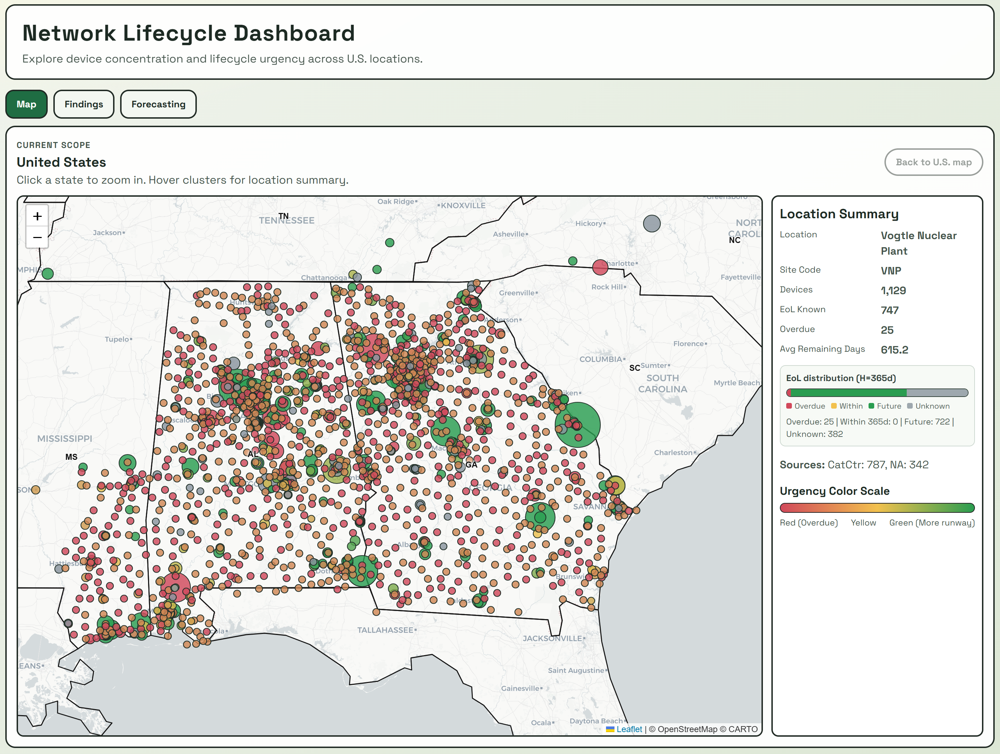
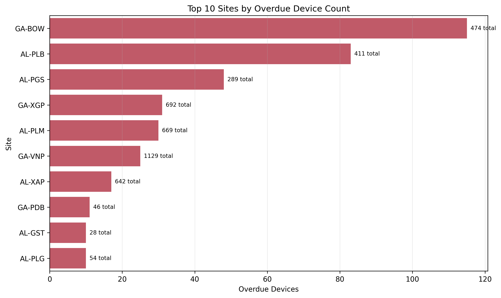
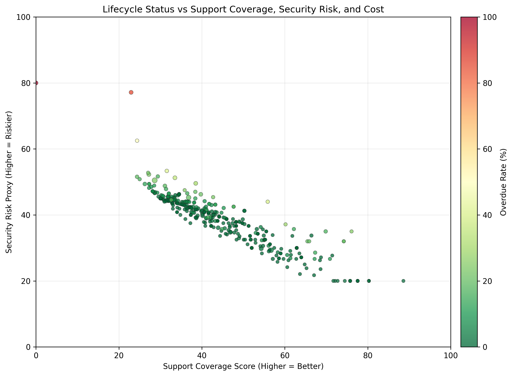
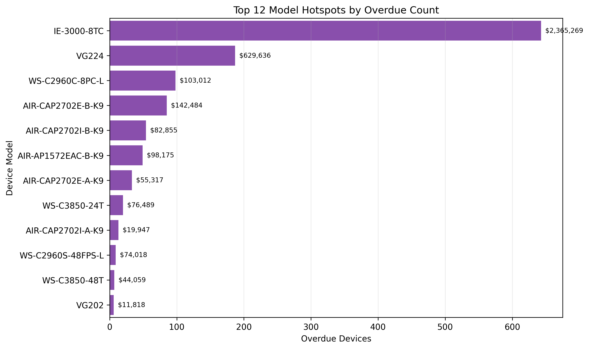
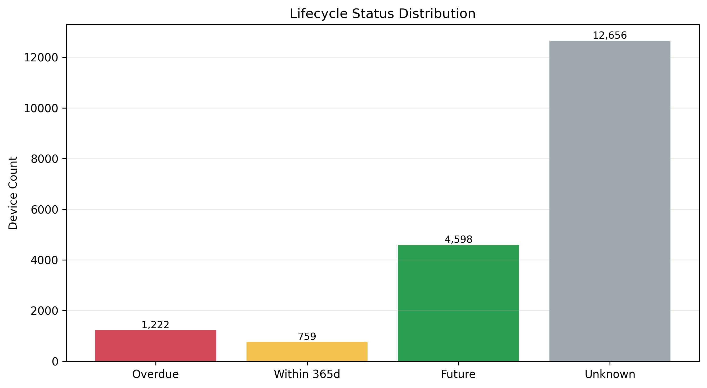
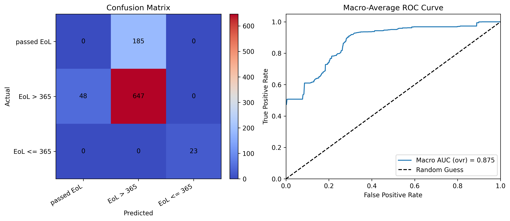

# UA Innovate 2026: Using Data to Evaluate Network Costs and Identify Opportunities for Improvement/Optimization

  

## Executive Summary
This report summarizes the current network lifecycle posture based on Southern Company infrastructure datasets and our consolidated device-level analytics pipeline.

Key snapshot (current `data/device_dataset.csv`, mapped locations only):
- Total devices analyzed (mapped): **18,845**
- Unique mapped sites: **1,852**
- States represented: **19**
- Overdue devices (`days_to_eol < 0`): **1,173**
- Devices within 365-day horizon: **758**
- Devices with unknown EoL: **12,444**
- Estimated near-term replacement exposure (overdue + within horizon): **$6.85M**

Count reconciliation:
- Total rows in `data/device_dataset.csv`: **19,235**
- Rows used for map/site-level findings: **18,845**
- Difference (**390**) comes from rows without complete location mapping (`loc_state`, `loc_site_code`, `loc_latitude`, or `loc_longitude` missing), which are excluded from location-based summaries and map visuals.

The analysis indicates concentrated lifecycle backlog at a small set of sites and material replacement exposure concentrated in specific operating regions and model families.

## Business Objective
Enable leadership to:
- Quantify near-term lifecycle replacement risk and cost exposure.
- Identify locations and model families with outsized backlog.
- Prioritize remediation actions before proceeding to ML-based forecasting and optimization.

## Data Inputs
Primary workbook:
- `data/UAInnovateDataset-SoCo.xlsx`

Generated working dataset:
- `data/device_dataset.csv`

Tabs integrated:
- Inventory systems: `CatCtr`, `PrimeAP`, `PrimeWLC`, `NA`
- Site/location metadata: `SOLID`, `SOLID-Loc`
- Lifecycle/cost metadata: `ModelData`, `Pricing`

## Data Preparation and Filtering Logic
Implemented in:
- `src/utils/data/data_loader.py`

Core processing steps:
1. Load all workbook tabs (`wrangle`).
2. Apply business filters (`apply_filter`):
- Remove decommissioned sites from `SOLID` and `SOLID-Loc`.
- In `CatCtr`, remove unreachable/degraded entries (`Unreachable`, `Ping Reachable`).
- Remove unsupported rows with missing `hostname` in `CatCtr`.
- Deduplicate across inventory sources using name matching precedence.
- Remove inactive NA devices (`Device Status = Inactive`).
- Exclude NA device types out of scope (`Wireless Controller`, `Firewall`, `Virtual Firewall`, `WirelessLC`).
3. Build unified device dataset (`get_device_dataset`):
- Normalize identities and map each device to location attributes (`state/site code` + `SOLID`/`SOLID-Loc`).
- Join lifecycle and replacement metadata from `ModelData`.
- Join replacement pricing signals from `Pricing`.
4. Clean analytical dataset (`clean_device_dataset`) by dropping low-value/noisy columns.

## Findings
### 1) National and Site-Level Visibility (Dashboard Map)
The interactive map view supports state and site-level lifecycle triage.

### 2) Highest Backlog Sites (Top 10 Overdue)
Overdue lifecycle burden is concentrated in a limited number of sites, supporting targeted intervention over broad, undifferentiated action.

#### Near-Term Cost Calculation (Used in Top-10 Ranking)
Per-device replacement estimate:
- If `pricing_total_estimate` is available, use it.
- Else use `modeldata_material_cost`.
- Else use `0`.

Near-term scope flag:
- Include device if `days_to_eol < 0` (overdue), or
- Include device if `0 <= days_to_eol <= 365` (within horizon), else exclude.

Near-term contribution per device:
- `near_term_cost_i = in_scope_i * replacement_cost_i`

Portfolio/site near-term exposure:
- `NearTermExposure = sum(near_term_cost_i)`

Note:
- `modeldata_material_cost` is material-side (device + DNA + staging + tax/overhead).
- Labor is tracked separately in `modeldata_labor_cost` and is not currently added into this near-term exposure.

#### Top 10 Overdue Sites (Current Snapshot)
| Rank | Site | Overdue Devices | Total Devices | Near-Term Cost |
|---:|---|---:|---:|---:|
| 1 | GA-BOW (Plant Bowen) | 115 | 474 | $263,498.77 |
| 2 | AL-PLB (APC - Plant Barry) | 83 | 411 | $158,117.88 |
| 3 | AL-PGS (APC - Plant Gaston) | 48 | 289 | $116,276.01 |
| 4 | GA-XGP (GPC - Corp HQ) | 31 | 692 | $172,226.39 |
| 5 | AL-PLM (APC-Miller Steam Plant) | 30 | 669 | $93,801.34 |
| 6 | GA-VNP (Vogtle Nuclear Plant) | 25 | 1,129 | $64,309.02 |
| 7 | AL-XAP (APC - Corp Hdqtrs) | 17 | 642 | $46,016.96 |
| 8 | GA-PDB (Plant Dahlberg) | 11 | 46 | $39,840.49 |
| 9 | AL-GST (GSC#10-Telecom Shack) | 10 | 28 | $33,670.40 |
| 10 | AL-PLG (Plant Gorgas) | 10 | 54 | $21,698.65 |

### 3) Lifecycle vs Support Coverage, Security Risk, and Cost
Site-level risk/cost patterns show clusters where low lifecycle runway aligns with higher security-risk proxy and larger near-term cost pressure.

Security risk proxy definition (device-level):
- `days_to_eol = recommended_eol_date - today`
- Base risk by lifecycle status:
  - `80` if overdue (`days_to_eol < 0`)
  - `50` if within horizon (`0..365`)
  - `20` if future (`>365`)
  - `45` if EoL unknown
- Additions:
  - `+10` if both software and firmware telemetry are missing
- Final clamp:
  - `risk_i = clamp(base_i + 10*missing_version_i, 0, 100)`

### 4) Model Hotspots
A subset of models drives disproportionate overdue counts and near-term replacement cost exposure.

### 5) Portfolio Lifecycle Distribution
Unknown EoL coverage remains high and is itself a planning risk because it weakens confidence in replacement forecasting.

## Risk and Limitations
- EoL coverage is incomplete (large unknown segment), which limits confidence in deterministic replacement scheduling.
- Security risk is a **proxy metric** derived from lifecycle status and telemetry completeness; it is not a direct vulnerability feed.
- Cost signals are estimated from available pricing/model mappings and should be treated as planning-grade, not final procurement quotes.

## Business Recommendations (Near-Term)
1. Launch a targeted remediation plan for the highest-backlog sites first (top-10 focus).
2. Establish a data quality sprint to reduce unknown EoL share and improve forecast reliability.
3. Prioritize model families with both high overdue counts and high near-term cost exposure.
4. Use state/site call-group allocation to stage operational execution capacity.

## Machine Learning Model for 12-Month Expiry Prediction
We implemented an initial machine-learning pilot in `notebooks/02_model.ipynb` to classify devices into:
- `-1`: already passed EoL
- `1`: expected to expire within 365 days
- `0`: EoL more than 365 days away

Modeling workflow:
1. Start from cleaned `data/device_dataset.csv` and keep rows with known EoL labels for supervised training.
2. Build the 3-class target from `days_to_eol`.
3. Train a Random Forest classifier with train-only preprocessing and grouped validation logic to reduce leakage.
4. Evaluate using confusion matrix and ROC/AUC, with additional emphasis on class-wise recall.

Current result:
- Overall AUC is strong (about **0.875**), but performance is not balanced across classes.
- The model is much better at predicting class `0` (`EoL > 365`), which is the majority class and generally corresponds to newer platforms.
- In the current confusion matrix, the model produced **zero predictions for the passed-EoL class** in some runs, which is operationally unacceptable.

Why this happened:
- The training set has substantial missing EoL values overall, limiting label coverage for supervised learning.
- Passed-EoL devices include extreme edge cases (for example, devices that are **1,000+ days past EoL**), and these older/rare patterns are underrepresented and harder for the model to learn.

Next improvement direction:
- Re-balance training and scoring to prioritize recall for passed-EoL first, then within-12-month devices, and only then the default long-runway class.
- Add feature engineering for older device cohorts and calibration/threshold tuning focused on minority critical classes.

## Appendix Visuals
Additional technical visuals available in `reports/`:
- `appendix_days_to_eol_distribution.png`
- `appendix_overdue_age_distribution.png`
- `appendix_state_exposure.png`
- `appendix_source_lifecycle_mix.png`
- `appendix_category_lifecycle_heatmap.png`
- `appendix_owner_risk_boxplot.png`
- `appendix_call_group_backlog.png`
- `appendix_unknown_eol_by_state.png`
- `appendix_cost_composition.png`
- `appendix_site_priority_matrix.png`
